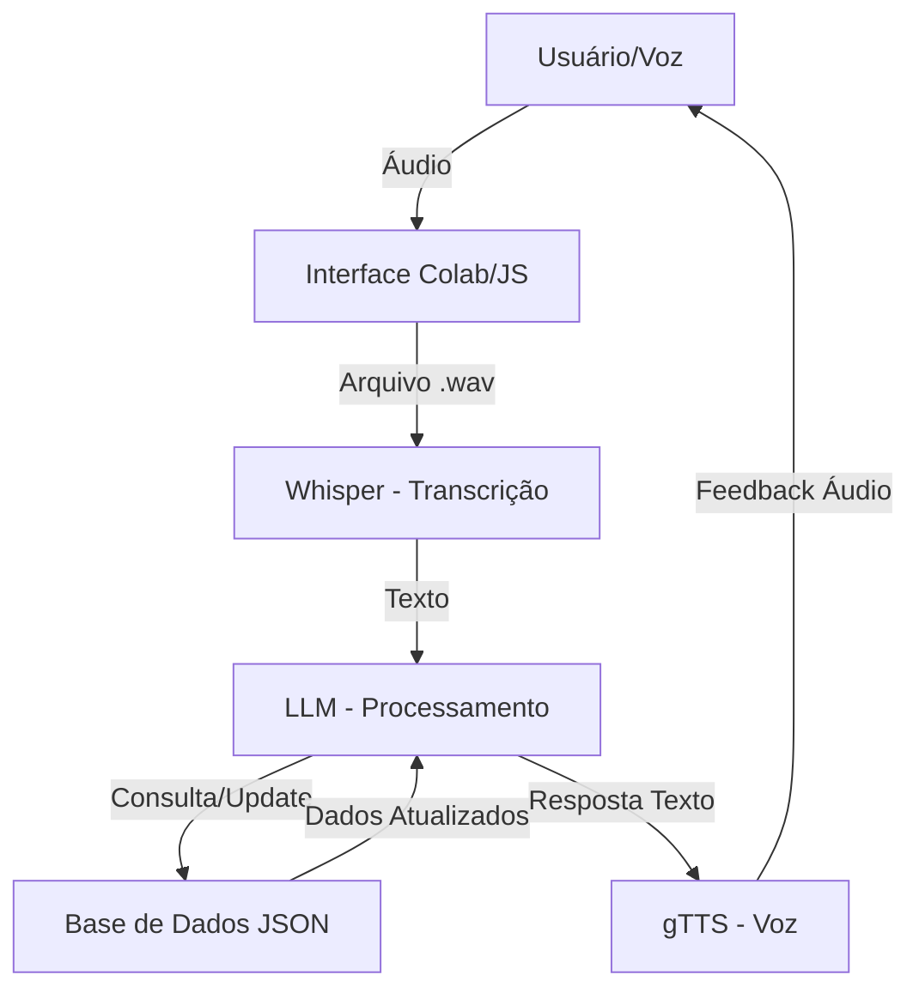

# Documentação do Agente

## Caso de Uso

### Problema
> Qual problema financeiro seu agente resolve?

A dificuldade de manter um controle financeiro rigoroso em tempo real. Muitas pessoas desistem de anotar gastos diários devido à burocracia de abrir aplicativos, digitar valores e categorizar despesas manualmente, o que gera furos no orçamento no final do mês.

### Solução
> Como o agente resolve esse problema de forma proativa?

O **ByteSafe Voice Advisor** resolve esse problema através de uma interface **Voice-First**. O agente utiliza Processamento de Linguagem Natural (NLP) para ouvir comandos de voz, extrair automaticamente o valor e a categoria da despesa (ex: "Gastei 50 reais com almoço") e atualizar o saldo instantaneamente em uma base de dados local, oferecendo feedback por voz sobre a saúde financeira.

### Público-Alvo
> Quem vai usar esse agente?

Jovens profissionais, entusiastas de tecnologia e estudantes (como Jovens Aprendizes) que precisam de agilidade e uma forma intuitiva de gerir suas finanças sem interromper suas atividades principais.

---

## Persona e Tom de Voz

### Nome do Agente
**ByteSafe Advisor**

### Personalidade
> Como o agente se comporta? (ex: consultivo, direto, educativo)

**Consultivo e Educativo.** O agente se comporta como um mentor financeiro digital. Ele é organizado, encorajador e focado em ajudar o usuário a atingir metas de economia.

### Tom de Comunicação
> Formal, informal, técnico, acessível?

**Acessível e Direto.** Utiliza uma linguagem clara, evitando "financês" complexo, mas mantendo a seriedade que o tema dinheiro exige.

### Exemplos de Linguagem
- **Saudação:** "Olá! Sou o ByteSafe Advisor. Qual transação vamos organizar agora?"
- **Confirmação:** "Entendido! Registrei sua despesa de R$ 35,00 em 'Alimentação'. Seu saldo atualizado é de R$ 450,00."
- **Erro/Limitação:** "Não consegui entender o valor. Poderia repetir apenas o quanto você gastou e com o quê?"

---

## Arquitetura

### Diagrama

### Componentes

| Componente | Descrição |
|------------|-----------|
| Interface | Script Python em Google Colab com integração JavaScript para captura de microfone. |
| LLM | Whisper (OpenAI) para Speech-to-Text e Gemini/GPT/Ollama para extração de entidades e lógica. |
| Base de Conhecimento | Arquivo JSON estruturado que armazena o histórico de lançamentos e limites de gastos. |
| Validação | gTTS (Google Text-to-Speech) para transformar as respostas do agente em áudio. |

---

## Segurança e Anti-Alucinação

### Estratégias Adotadas

[x] Contexto Estrito: O agente só responde sobre o saldo com base nos valores reais contidos no arquivo JSON.

[x] Confirmação Ativa: Para valores acima de R$ 500,00, o agente solicita uma confirmação extra antes de registrar.

[x] Admissão de Falha: Caso a transcrição do Whisper seja ambígua, o agente não chuta valores; ele pede para o usuário repetir.

[x] Filtro de Escopo: O agente ignora perguntas que não sejam relacionadas a finanças ou ao funcionamento do próprio sistema.

### Limitações Declaradas
> O que o agente NÃO faz?

> O agente NÃO realiza transações bancárias reais (PIX, transferências ou pagamentos).

> O agente NÃO acessa contas bancárias externas via API (opera apenas em base de dados simulada).

> O funcionamento depende 100% de conectividade com a internet para processamento das LLMs.
